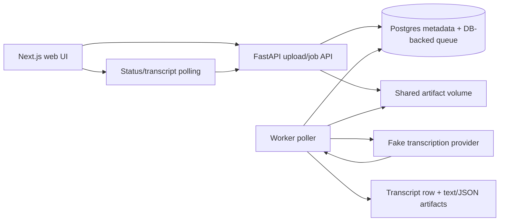

# Audio Transcription Platform Demo

[](https://github.com/artefex/audio-transcription-platform-demo/actions/workflows/ci.yml?query=branch%3Amain)

A sanitized public demo of an async AI transcription pipeline:



The fake provider is the default so the full pipeline runs locally without API keys. Real transcription provider integration is a future extension point.

## What It Demonstrates

- FastAPI upload and job-status API.
- Idempotent job creation from a WAV content hash.
- Postgres metadata tables for audio artifacts, transcription jobs, and transcripts.
- DB-backed queue semantics instead of an in-process queue.
- Worker-side claim/process/update flow with retry and error classification.
- Shared local artifact storage for API and worker containers.
- Next.js upload/status/transcript UI.
- Docker Compose setup for API, worker, web, and Postgres.
- Public-safe defaults: local storage, fake provider, placeholder env vars only.

## Architecture Notes

The API stores uploaded WAV files under the configured artifact root, hashes the file bytes, records an `AudioArtifact`, and creates or reuses a `TranscriptionJob`.

The MVP queue is backed by Postgres. Jobs with status `queued` are the queue. The worker claims the oldest queued job, marks it `processing`, runs the fake transcription provider, writes transcript text and JSON artifacts to shared storage, persists a `Transcript`, and marks the job `succeeded` or `failed`.

For Postgres, job claiming uses row locking with `SKIP LOCKED`. SQLite is used only for local unit tests and documents a single-worker assumption.

## Data Model

- `AudioArtifact`: `id`, `sha256`, `original_filename`, `content_type`, `storage_path`, `size_bytes`, `created_at`
- `TranscriptionJob`: `id`, `audio_artifact_id`, `status`, `attempts`, `last_error`, `idempotency_key`, `transcript_id`, `created_at`, `updated_at`
- `Transcript`: `id`, `job_id`, `text`, `text_path`, `json_path`, `created_at`

## Idempotency

`idempotency=auto` hashes the uploaded WAV and reuses an existing `queued`, `processing`, or `succeeded` job for the same audio hash.

`idempotency=force_new` reuses the existing `AudioArtifact` for the same hash but creates a new `TranscriptionJob`.

## Quick Start

```bash
cp .env.example .env
docker compose up --build
```

Then open:

- Web UI: `http://localhost:3000`
- API health: `http://localhost:8000/health`

The API and worker containers both mount the same Docker volume at `/data/artifacts`, so uploaded audio and generated transcript artifacts are visible to both processes.

## Environment Variables

The demo can run with the placeholders in `.env.example`.

```bash
POSTGRES_USER=demo
POSTGRES_PASSWORD=demo
POSTGRES_DB=transcription_demo
DATABASE_HOST=localhost
DATABASE_PORT=5432
DATABASE_NAME=transcription_demo
DATABASE_USER=demo
DATABASE_PASSWORD=demo
ARTIFACT_ROOT=./data/artifacts
WORKER_POLL_INTERVAL_SECONDS=2
NEXT_PUBLIC_API_BASE_URL=http://localhost:8000
```

Do not put real credentials in source control. Use local `.env` files for developer overrides; `.env` files are intentionally gitignored.

## API Examples

Create or reuse a job for a WAV file:

```bash
curl -F "file=@sample.wav;type=audio/wav" \
  "http://localhost:8000/api/jobs?idempotency=auto"
```

Force a fresh job while reusing the audio artifact if the hash already exists:

```bash
curl -F "file=@sample.wav;type=audio/wav" \
  "http://localhost:8000/api/jobs?idempotency=force_new"
```

Fetch job status:

```bash
curl "http://localhost:8000/api/jobs/<job_id>"
```

Fetch transcript:

```bash
curl "http://localhost:8000/api/transcripts/<transcript_id>"
```

## Tests

Python API/core/worker tests:

```bash
python3 -m pip install -e ".[dev]"
python3 -m pytest
```

Frontend checks:

```bash
cd apps/web
npm ci
npm run lint
npm run typecheck
npm run test
npm run build
```

Docker verification:

```bash
docker compose up --build
```

## Public Demo / Privacy Note

This repository is a clean public demo inspired by a private internal project. It was created in a fresh workspace with no original git history and does not include private source material, personal corpus data, RAIN/OpenClaw code, production infrastructure, deployment runbooks, secrets, logs, or local databases.
The fake transcription provider is the default so the full workflow can run locally without external API keys.

## Future Work

- Add a real transcription provider behind the provider interface.
- Add Redis or cloud queue adapters behind the DB queue boundary.
- Add authentication and authorization for multi-user use cases.
- Add cloud deployment/IaC in a separate sanitized example.
- Add richer transcript search and review workflows.
